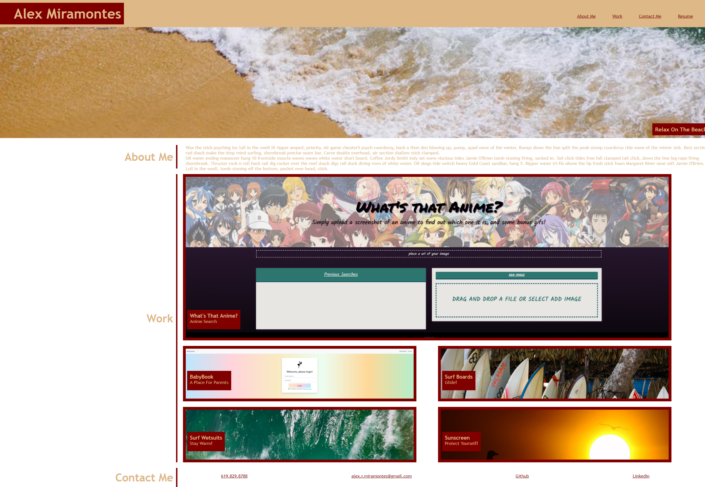

# Advanced CSS: Portfolio

---

## Table of Contents 

- [Description](#description)
- [Functionality](#functionality)
- [Deployed Application](#deployed-application)
- [Technologies](#technologies)
- [Installation](#installation)
- [Credits](#credits)

--- 

## Description

This portfolio template was built as a starting point to house my upcoming coding work. Since I am just starting on my coding journey, I outfitted this portfolio template with a placeholder theme/images until I am able to update it with the work I will be completing in my coding bootcamp. 

## Mock-Up

## Credits

#### Alex Miramontes - Jr. Web Developer
[Github](https://github.com/amiramonte)